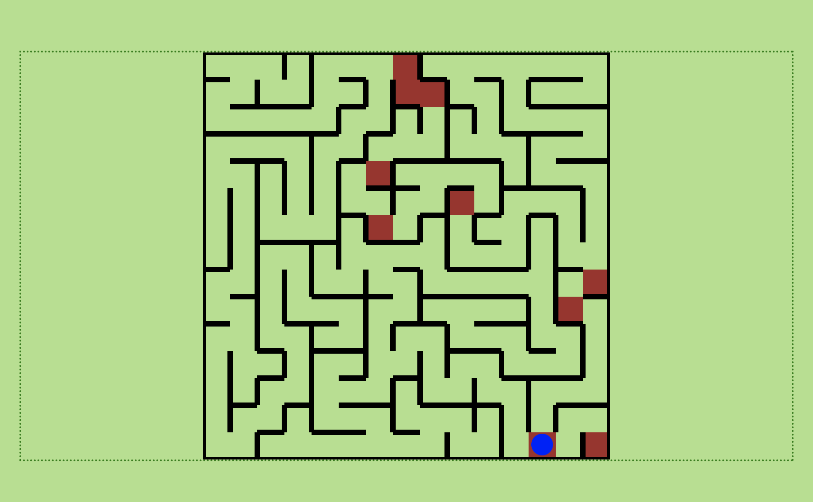

# Mind Maze - Interactive Web Game



Mind Maze is an engaging, responsive web-based puzzle game that combines maze navigation with trivia challenges. Players must navigate through a maze while answering trivia questions at checkpoints to progress, creating a unique blend of spatial reasoning and knowledge-based gameplay.

## 🎯 Project Objectives

### Primary Goals
- **Engaging Gameplay**: Create an interactive web game that's fun and challenging, playable across desktop, tablet, and mobile devices
- **Hybrid Mechanics**: Blend puzzle navigation with trivia gameplay where maze progress requires correct answers at checkpoint "doors"
- **Strategic Elements**: Implement a "master key" mechanic allowing limited skips of difficult trivia challenges
- **Progress Tracking**: Monitor and display player performance including questions answered, skips used, and completion status
- **Replayability**: Provide variety through randomized maze layouts and trivia questions each session
- **Accessibility**: Ensure readable text, clear buttons, and support for both keyboard and touch controls

### User Goals
- **Entertainment**: Have fun while being challenged with maze navigation and trivia questions
- **Cross-Platform Compatibility**: Play seamlessly on any device without performance or display issues
- **Intuitive Gameplay**: Understand rules quickly without lengthy instructions
- **Strategic Decision-Making**: Use master keys strategically to skip difficult questions
- **Performance Feedback**: Receive clear feedback on correct/incorrect answers, maze progress, and remaining skips
- **Varied Experience**: Enjoy replay value with randomized content that prevents repetitive gameplay

## 🚀 Features

### Core Gameplay

#### Maze Navigation
- **Movement Controls**: Navigate using keyboard arrows, WASD keys, or touch/swipe controls on mobile
- **Cross-Platform Input**: Seamless control experience across desktop, tablet, and mobile devices
- **Objective**: Reach the maze exit to complete the game

#### Trivia Doors System
- **Locked Doors**: Strategic tiles throughout the maze that block player progress
- **Question Challenge**: Each door presents a multiple-choice trivia question
- **Pass Conditions**: 
  - Correct answer = door opens immediately
  - Wrong answer = door remains locked (retry option or use master key)
- **Interactive Feedback**: Immediate response showing correct/incorrect with answer highlighting

#### Master Key Skip Mechanism
- **Limited Resource**: Fixed number of master keys per game session
- **Strategic Usage**: Each skip consumes one master key and opens any door instantly
- **Resource Management**: Players must decide when to use skips vs. attempt answers

### Trivia System

#### Question Bank & API Integration
- **Dynamic Content**: Trivia questions fetched via external API
- **Categorized Pool**: Questions organized by subject categories
- **Random Selection**: Different questions each game session for replayability
- **User Choice**: Category selection available (difficulty permitting)

#### Question Format & Feedback
- **Multiple Choice**: Tappable button interface for answers
- **Immediate Response**: Instant "Correct/Incorrect" feedback
- **Educational Value**: Correct answer highlighted when player answers incorrectly
- **Responsive Design**: Optimized for both desktop clicks and mobile taps

#### Difficulty Variation
- **Category Selection**: Users can choose preferred trivia categories (time permitting)
- **Adaptive Questioning**: Difficulty scales with game progression
- **Balanced Challenge**: Questions calibrated for engaging but fair gameplay

### Game Progress & State Management

#### Score Tracking System
- **Correct Answers**: Running count of successfully answered questions
- **Master Key Usage**: Track number of skips used during gameplay
- **Performance Metrics**: Comprehensive statistics for player improvement
- **Session History**: Game-by-game progress tracking

#### Game Over Conditions
- **Victory Condition**: Successfully reaching the maze exit
- **Failure Scenarios**: Running out of master keys while blocked by unanswered doors
- **Retry Options**: Ability to restart with new maze layout and questions

### UI/UX Design

#### Responsive Layout
- **Bootstrap Framework**: Scalable maze display using Bootstrap grid system
- **Device Adaptation**: Automatic scaling for desktop, tablet, and mobile screens
- **Modal System**: Bootstrap modals for trivia questions on mobile devices
- **Touch Optimization**: Mobile-first design with appropriate touch targets

#### HUD (Heads-Up Display)
- **Master Keys Counter**: Real-time display of remaining skips
- **Position Indicator**: Current location within the maze
- **Score Display**: Live tracking of questions answered correctly
- **Progress Bar**: Visual representation of maze completion percentage

#### Control Systems
- **Dual Input Support**: Full keyboard and touch control implementation
- **Accessibility**: Keyboard navigation for screen readers and motor accessibility
- **Gesture Recognition**: Swipe controls for intuitive mobile navigation

### Replay & Randomization

#### Dynamic Maze Generation
- **Unique Layouts**: Different maze configuration each playthrough
- **Algorithmic Generation**: Procedural maze creation ensuring solvable paths
- **Scalable Complexity**: Maze size adapts to difficulty settings

#### Question Randomization
- **Shuffled Order**: Trivia questions randomized each game session
- **Category Mixing**: Balanced distribution across selected categories
- **Difficulty Progression**: Questions may increase in difficulty as players advance

### Game Modes & Settings

#### Intro Screen & Tutorial
- **Welcome Interface**: Game title and branding display before maze begins
- **How to Play**: Comprehensive tutorial covering:
  - Movement controls (keyboard, touch, swipe)
  - Trivia door mechanics
  - Master key usage strategies
  - Scoring system explanation

#### Difficulty Settings
- **Easy Mode**: 
  - Fewer trivia doors for gentler learning curve
  - User selects single preferred category
  - Smaller maze size (Y1 x Y1 grid)
- **Medium Mode**:
  - Moderate number of doors for balanced challenge
  - Choice from 4 different categories
  - Medium maze size for extended gameplay
- **Hard Mode** (Future Implementation):
  - Maximum doors and complexity
  - All categories mixed
  - Large maze size for expert players

#### Customization Options
- **Maze Size**: Adjustable grid dimensions based on difficulty
- **Door Frequency**: Variable number of trivia checkpoints
- **Category Selection**: Player choice in trivia subjects
- **Master Key Count**: Difficulty-based number of available skips

### Technical Implementation
- **API Integration**: External trivia question database connectivity
- **State Management**: Persistent game state throughout session
- **Responsive Design**: Bootstrap 5.3.3 for cross-device compatibility
- **Performance Optimization**: Efficient rendering for smooth gameplay
- **Progressive Enhancement**: Core functionality works without advanced features

## 🛠️ Technology Stack

### Frontend Technologies
- **HTML5**: Semantic markup with accessibility features
- **CSS3**: Custom styling with CSS variables, flexbox, and grid
- **Bootstrap 5.3.3**: Responsive grid system, modals, and components
- **JavaScript ES6+**: Game logic, API integration, and interactive functionality
- **Font Awesome**: Icons and visual elements for UI enhancement

### External Integrations
- **Trivia API**: Dynamic question fetching from external trivia databases
- **Bootstrap CDN**: Fast loading of framework assets
- **Font Awesome Kit**: Icon library for enhanced visual design

### Development Tools
- **Git**: Version control and collaboration
- **GitHub**: Repository hosting and deployment
- **VS Code**: Primary development environment
- **Live Server**: Local development server for testing

### Game Architecture
- **Modular JavaScript**: Separated game logic, UI management, and API handling
- **State Management**: Persistent game state throughout sessions
- **Event-Driven Design**: Responsive user interaction handling
- **Progressive Enhancement**: Core functionality without JavaScript dependencies

## 📱 Responsive Design

The game is fully responsive with optimized breakpoints:
- **Extra Small Devices** (< 576px): Phones in portrait mode
- **Small Devices** (< 768px): Phones and small tablets
- **Medium Devices** (768px - 991.98px): Tablets
- **Large Devices** (992px - 1199.98px): Desktops
- **Extra Large Devices** (≥ 1200px): Large desktop screens

## 🎮 Game Mechanics

### Core Gameplay Loop
1. **Game Initialization**: Player selects difficulty and trivia categories
2. **Maze Generation**: Dynamic maze layout created with randomized trivia doors
3. **Navigation Phase**: Player moves through maze using keyboard, WASD, or touch controls
4. **Trivia Encounters**: At locked doors, multiple-choice questions appear via modal/interface
5. **Decision Point**: Player chooses to answer question or use master key skip
6. **Progress Continuation**: Successful answers or skips open doors, allowing maze progression
7. **Victory Condition**: Reaching maze exit completes the game with performance summary

### Movement System
- **Desktop Controls**: Arrow keys or WASD for directional movement
- **Mobile Controls**: Swipe gestures or tap-to-move navigation
- **Collision Detection**: Walls and locked doors prevent invalid movement
- **Smooth Animation**: Fluid transitions between maze positions

### Trivia Door Mechanics
- **Door Placement**: Strategic positioning throughout maze to create engaging challenges
- **Question Presentation**: Bootstrap modal system displays trivia with multiple choice options
- **Answer Validation**: Immediate feedback with correct answer highlighting
- **Retry System**: Incorrect answers allow multiple attempts or master key usage
- **Door States**: Visual indicators for locked, unlocked, and completed doors

### Master Key System
- **Resource Management**: Limited quantity based on difficulty setting
- **Strategic Decision**: Players must choose when to skip vs. attempt answers
- **Visual Counter**: HUD displays remaining master keys at all times
- **One-Time Use**: Each skip permanently consumes one master key
- **Emergency Option**: Prevents total game blockage when stuck on difficult questions

### Scoring & Progress
- **Correct Answer Tracking**: Points awarded for each successful trivia response
- **Efficiency Bonus**: Higher scores for completing with fewer master key uses
- **Completion Time**: Speed factor in final score calculation
- **Progress Percentage**: Visual indicator of maze completion status

### API Integration Features
- **Dynamic Question Loading**: Real-time trivia fetching from external databases
- **Category Filtering**: API requests filtered by player-selected subjects
- **Question Caching**: Efficient storage to prevent repeated API calls
- **Fallback System**: Local question bank if API unavailable

## 📂 Project Structure

```
mind-maze-hackathon-ci/
├── index.html              # Main game interface
├── README.md               # Project documentation
├── assets/
│   ├── css/
│   │   └── style.css       # Custom styles and responsive design
│   ├── images/             # Game assets and graphics
│   └── js/
│       └── script.js       # Game logic and interactivity
├── .github/                # GitHub workflow configurations
└── .git/                   # Git repository data
```

## 🚦 Getting Started

### Prerequisites
- Modern web browser (Chrome, Firefox, Safari, Edge)
- Internet connection for CDN resources (Bootstrap, Font Awesome)

### Installation & Quick Start
1. **Clone the repository**:
   ```bash
   git clone https://github.com/nicolae-cristoloveanu/mind-maze-hackathon-ci.git
   ```

2. **Navigate to project directory**:
   ```bash
   cd mind-maze-hackathon-ci
   ```

3. **Launch the game**:
   - **Simple**: Double-click `index.html` to open in your default browser
   - **Development**: Use a local server for full functionality

### Development Setup
For active development with API integration and full features:

**Option 1: Python Server**
```bash
# Navigate to project folder
cd mind-maze-hackathon-ci

# Start local server (Python 3)
python -m http.server 8000

# Open browser to: http://localhost:8000
```

**Option 2: Node.js Live Server**
```bash
# Install live-server globally (if not already installed)
npm install -g live-server

# Start server in project directory
live-server

# Automatically opens browser with live reload
```

**Option 3: VS Code Live Server Extension**
```bash
# Install "Live Server" extension in VS Code
# Right-click on index.html
# Select "Open with Live Server"
```

### Game Controls
- **Desktop**: Use arrow keys or WASD for movement
- **Mobile/Tablet**: Swipe in desired direction or tap adjacent cells
- **Trivia**: Click/tap answer buttons in modal dialogs
- **Master Keys**: Use dedicated button when encountering locked doors

### First Play Guide
1. **Start Game**: Choose difficulty level (Easy recommended for first play)
2. **Select Category**: Pick your preferred trivia subject (Easy mode)
3. **Navigate Maze**: Move using controls to explore the maze
4. **Answer Questions**: When encountering doors, answer trivia to proceed
5. **Use Master Keys**: Skip difficult questions strategically
6. **Reach Exit**: Complete the maze to see your final score

## 🎨 Customization

### Color Scheme
The game uses CSS custom properties for easy theming:
- **Primary Color**: `#F78E69` (Coral/Peach navbar)
- **Text Colors**: High contrast for accessibility
- **Feature Grid**: Gradient backgrounds for visual appeal

### Responsive Breakpoints
Modify media queries in `assets/css/style.css` to adjust responsive behavior:
```css
/* Extra Small Devices */
@media (max-width: 575.98px) { /* Styles */ }

/* Small Devices */
@media (max-width: 767.98px) { /* Styles */ }

/* Medium Devices */
@media (min-width: 768px) and (max-width: 991.98px) { /* Styles */ }
```

## 🔄 Future Development

### Immediate Roadmap (Phase 1)
- [x] **Core Maze Engine**: Basic navigation and movement system
- [x] **Trivia Integration**: API connection and question display system
- [x] **Master Key Mechanics**: Skip functionality implementation
- [ ] **Complete Game Loop**: Full integration of all core systems
- [ ] **Difficulty Settings**: Easy/Medium/Hard mode implementation
- [ ] **Score Persistence**: Local storage for high scores and progress

### Enhanced Features (Phase 2)
- [ ] **Advanced Maze Generation**: Multiple maze algorithms (recursive backtracking, Prim's, etc.)
- [ ] **Category Management**: Expanded trivia subject options
- [ ] **Achievement System**: Badges for milestones (perfect runs, speed completion, category mastery)
- [ ] **Visual Enhancements**: Smooth animations, particle effects, and improved graphics
- [ ] **Sound Design**: Audio feedback for movement, correct answers, and achievements
- [ ] **Leaderboards**: Global and local high score tracking

### Advanced Features (Phase 3)
- [ ] **User Authentication**: Player profiles and cloud save functionality
- [ ] **Multiplayer Mode**: Competitive maze racing with shared trivia challenges
- [ ] **Custom Maze Editor**: User-created maze layouts with sharing capabilities
- [ ] **Mobile App**: Native iOS and Android applications
- [ ] **Accessibility Enhancements**: Screen reader optimization, colorblind support
- [ ] **Analytics Dashboard**: Detailed player performance insights

### API & Backend Expansion
- [ ] **Multiple Trivia Sources**: Integration with various question databases
- [ ] **Custom Question Bank**: Admin interface for adding custom trivia
- [ ] **Difficulty Algorithms**: AI-driven question difficulty assessment
- [ ] **Performance Analytics**: Player behavior and completion rate analysis

### Contributing Guidelines
1. **Fork the Repository**: Create your own copy for development
2. **Feature Branches**: Use descriptive branch names (`feature/maze-generation`)
3. **Code Standards**: Follow existing code style and commenting conventions
4. **Testing**: Ensure all features work across desktop and mobile
5. **Pull Requests**: Provide clear descriptions of changes and testing performed

### Development Priorities
- **Core Functionality**: Complete basic game loop before advanced features
- **Mobile Optimization**: Ensure excellent mobile experience throughout development
- **Performance**: Maintain smooth gameplay on lower-end devices
- **Accessibility**: Build inclusive design principles into all features

## 📊 Performance Considerations

- **Optimized Assets**: Compressed images and minified CSS/JS for production
- **Responsive Images**: Multiple image sizes for different screen densities
- **Lazy Loading**: Deferred loading of non-critical resources
- **Progressive Enhancement**: Core functionality works without JavaScript

## ♿ Accessibility Features

- **Semantic HTML**: Proper heading hierarchy and landmark elements
- **ARIA Labels**: Screen reader support for interactive elements
- **Keyboard Navigation**: Full keyboard accessibility
- **Color Contrast**: WCAG compliant color combinations
- **Touch Targets**: Appropriately sized buttons for mobile devices

---

**Made with ❤️ for the Code Institute Hackathon**
